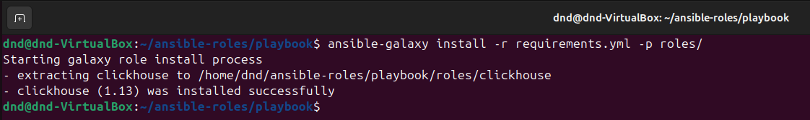
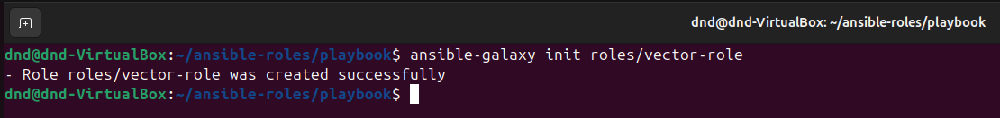
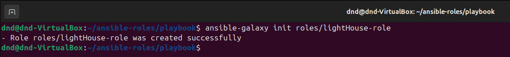
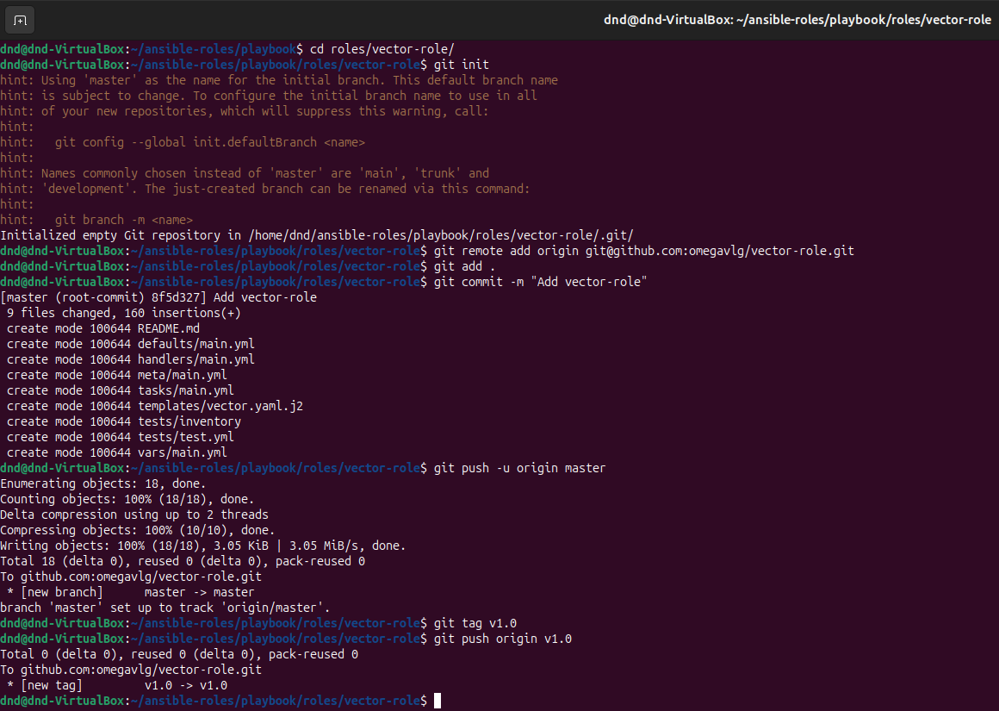
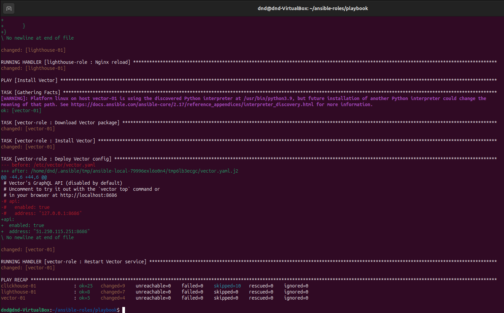

# Домашнее задание к занятию 4 «Работа с roles»

## Подготовка к выполнению

1. * Необязательно. Познакомьтесь с [LightHouse](https://youtu.be/ymlrNlaHzIY?t=929).
2. Создайте два пустых публичных репозитория в любом своём проекте: vector-role и lighthouse-role.
3. Добавьте публичную часть своего ключа к своему профилю на GitHub.

## Основная часть

Ваша цель — разбить ваш playbook на отдельные roles. 

Задача — сделать roles для ClickHouse, Vector и LightHouse и написать playbook для использования этих ролей. 

Ожидаемый результат — существуют три ваших репозитория: два с roles и один с playbook.

**Что нужно сделать**

1. Создайте в старой версии playbook файл `requirements.yml` и заполните его содержимым:

   ```yaml
   ---
     - src: git@github.com:AlexeySetevoi/ansible-clickhouse.git
       scm: git
       version: "1.13"
       name: clickhouse 
   ```
2. При помощи `ansible-galaxy` скачайте себе эту роль.
3. Создайте новый каталог с ролью при помощи `ansible-galaxy role init vector-role`.
4. На основе tasks из старого playbook заполните новую role. Разнесите переменные между `vars` и `default`. 
5. Перенести нужные шаблоны конфигов в `templates`.
6. Опишите в `README.md` обе роли и их параметры. Пример качественной документации ansible role [по ссылке](https://github.com/cloudalchemy/ansible-prometheus).
7. Повторите шаги 3–6 для LightHouse. Помните, что одна роль должна настраивать один продукт.
8. Выложите все roles в репозитории. Проставьте теги, используя семантическую нумерацию. Добавьте roles в `requirements.yml` в playbook.
9. Переработайте playbook на использование roles. Не забудьте про зависимости LightHouse и возможности совмещения `roles` с `tasks`.
10. Выложите playbook в репозиторий.
11. В ответе дайте ссылки на оба репозитория с roles и одну ссылку на репозиторий с playbook.


### Ответ:

1. Создаем файл **requirements.yml**:

**requirements.yml**

```
---
  - src: git@github.com:temagraf/ansible-clickhouse.git
    scm: git
    version: "1.13"
    name: clickhouse 
```

2. При помощи `ansible-galaxy` скачиваем роль:
```
ansible-galaxy install -r requirements.yml -p roles/
```


3. Создаем новый каталог с ролью:
```
ansible-galaxy init roles/vector-role
```


4. На основе **tasks** из старого **playbook** заполняем созданную **vector-role**.

Перечеь файлов:

**/roles/vector-role/defaults/main.yml**
**/roles/vector-role/handlers/main.yml**
**/roles/vector-role/meta/main.yml**
**/roles/vector-role/tasks/main.yml**
**/roles/vector-role/defaults/vector.yaml.j2**

7. Повторяем создание нового каталога для роли для роли **lightHouse-role** и заполняем ее из старого **playbook**.

```
ansible-galaxy init roles/lightHouse-role
```


8. Выкладываем **roles** в репозитории. Проставляем теги.

Для **vector**:

```
git init
git remote add origin git@github.com:temagraf/vector-role.git
git add .
git commit -m "Add vector-role"
git push -u origin master
git tag v1.0
git push origin v1.0
```


Для **lightHouse**:

```
git init
git remote add origin git@github.com:temagraf/lighthouse-role.git
git add .
git commit -m "Add lighthouse-role"
git push -u origin master
git tag v1.0
git push origin v1.0
```


Добавьте **roles** в **requirements.yml** в **playbook**.

```
---
  - src: git@github.com/AlexeySetevoi/ansible-clickhouse.git
    scm: git
    version: "1.13"
    name: clickhouse

  - src: git@github.com/temagraf/vector-role
    scm: git
    version: "v1.0"
    name: vector-role

  - src: git@github.com:temagraf/lighthouse-role.git
    scm: git
    version: "1.0"
    name: lighthouse-role
```

Запускае наш **playbook**:



Все отработало без ошибок.

ссылки на роли:

[lighthouse-role](https://github.com/temagraf/lighthouse-role)

[vector-role](https://github.com/temagraf/vector-role)
